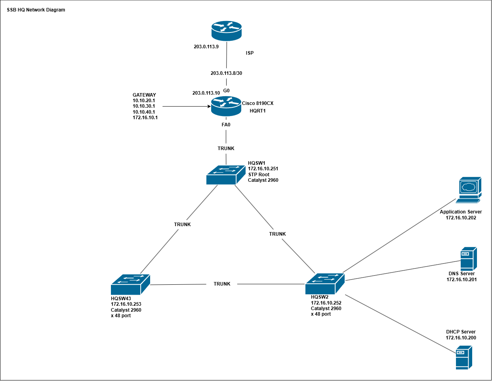

# Silver State Business Solutions

## Project Overview

### Business Scenarario
Silver State Business Solutions (SSBS) is a growing professional-services company opening a new headquarters and connecting it to an existing small branch office. The company currently has approximately 85 employees at headquarters and 20 employees at the branch. Management expects moderate growth over the next three years and does not want the network redesigned simply because another 20–30 employees are hired. 

### Scope 
Design an intiial network that will support Silver State Business current capasity and their ability to grow. 

>[!NOTE]
>Cisco Packet tracer:  Packet Tracer is a simulator, not an emulator. It mimics the behavior of commands rather than running real Cisco software. It lacks the capabilities to configure enterprise-grade protocols like BGP (Border Gateway Protocol), MPLS (Multiprotocol Label Switching), or DMVPN (Dynamic Multipoint VPN).

## Business & Technicla Requirments

- Headquarters
 1. Supports 85 users.
 2. HQ contains for business groups: Corportate, Engineering, Sales, and IT
 3. Users ind different depertments must be able to communicate where permited
 
- Branch
 1. Supports 20 users. 
 2. Uses diffent IP subnet then HQ
 
 - Infrasturcture
 1. Users devices are supported by DHCP
 2. DNS server must pervide name resolution for the company. 
 3. Application/Web Server is deployed on the internal network
 4. Infrasturcture seperate Infrasturcture for services, but must be able to grow. 
 
 - Internet
 1. ISP WAN IP allocation 203.0.113.8/30 
 2. Internal IP address must follow RFC1918 private IPv4 address. 
 
 - Availability

## Architecture

### Design Concept

Silver State HQ Design allows for one ISP connection connecting to company's Cisco 8190CX router (HQRT1). HHQRT1 (G0) will PAT 203.0.113.10 to the users IP address requesting WAN connection. HQRT1 will provide the gateways for the internal LAN be connecting the LAN infrastructure to FA0. 

The internal LAN consist of the access switches HQSW1 - HQSW3. HQSW1 is considered the "CORE" switch for this topology as it the switch directly connected to HQRT1 and is the STP Root for the LAN. HQSW2 is designated a critical switch in the infrastructure as it the primary connection point for the DHCP, DNC, and Application Server for the SSB. Each switch has been allocated a an IP address within the "Core Distribution" block. 

### Accpetpted Risk

The customer has accepted the risk for single points of failure between the router and access switch. You can see this in the design as HQRT1 is only connected to HQSW1. Also, the accepted the risk single point of failure between each switch as their only one inter face being used connect each switch. The design is not fault tolerant. 

## Network Design

### VLAN Design
|VLAN ID | Name | Network | Gateway | Purpose|
|--------|------|---------|---------|---------
|10|Corportate|headquarters|10.10.20.1|Segragates traffice into its own broadcast domoain|
|20|Sales|Headquarters|10.10.30.1|Segragates Sales into its own broadcast domain|
|30|Engineering|Headquarters|10.10.30.1|Segragates Engineering into its own broadcast domain|
|222| IT Team | Headquarters | 172.16.10.1 | Provides & Segragates the IT user / managmnet networks

### IP Addressing 

- HQ User networks
  
|VLAN ID| Target | CIDR | Gatweay | DHCP Usable Range|
|--------|--------|------|---------|-----------------|
|10| Corporate Users | 10.10.20.0/24 | 10.10.20.1 | 10.10.20.2 - 10.10.20.254|
|20| Sales Users | 10.10.30.0/24 | 10.10.30.1 | 10.10.30.2 - 10.10.30.254|
|30| Engineering Uusers| 10.10.40.0/24 | 10.10.40.1 | 10.10.40.2 - 10.10.40.24 |
|222| IT Uuser | 172.16.10.0/24| 172.16.10.1 |172.16.10.2 - 172.16.10.148|

- HQ Infrasturcture / static range
  
|IP Range | Allocation Target | Purpose|
|---------|-------------------|--------|
|10.10.20.1 | Gateway | Core Router termination point fore VLAN 10 & Internal routing |
|10.10.30.1 | Gateway | Core Router termination point fore VLAN 20 & Internal routing |
|10.10.40.1 | Gateway | Core Router termination point fore VLAN 30 & Internal routing |
|10.10.20.2 - 10.10.20.254 | DHCP Pool | DHCP Pool for VLAN 10|
|10.10.30.2 - 10.10.30.254 | DHCP Pool | DHCP Pool for VLAN 20|
|10.10.40.2 - 10.10.40.254 | DHCP Pool | DHCP Pool for VLAN 30|
|172.16.10.2 -172.16.10.148 | DHCP Pool | DHCP Pool for VLAN 222|
|172.16.10.149 - 172.16.10.199| HQ Device Block | To reserve space for HQ devices that need IP reservation | 
|172.16.10.200 - 172.16.10.220| HQ Server Block | To reserve space server for server and all them to grow | 
|172.16.10.221 - 172.16.10.239 | No Target | Space is unreserved at this point| 
|172.16.10.240 - 172.16.10.245 |Core, Distrobution, and access, switches | SVI / Management VLAN interface | 

# Follow Me!

Please follow me as I work through this project. 

## [Lessons Learned](./Lesson_Learned.md)
## Verification
