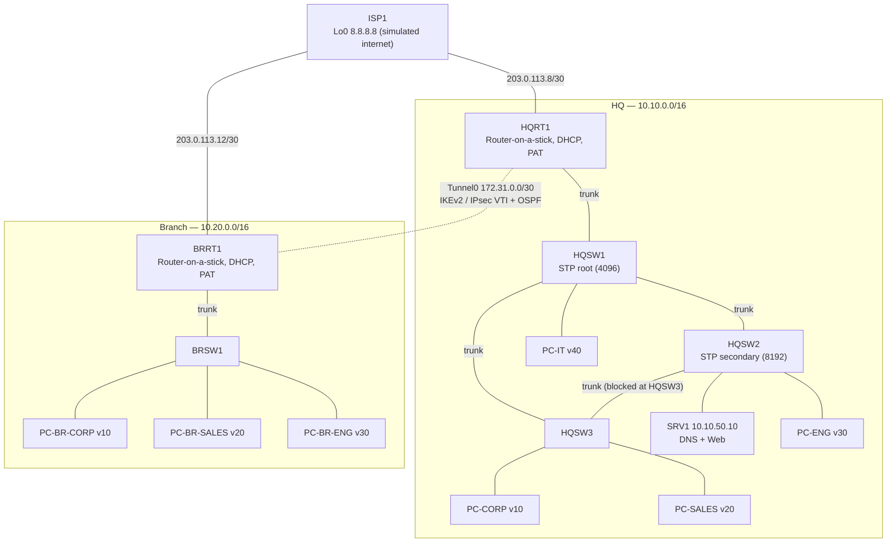

# Silver State Business Solutions (SSBS)

## Scenario

Silver State Business Solutions is a professional-services company opening a new headquarters and connecting it to an existing branch office. HQ has ~85 employees and the branch ~20. Management expects moderate growth over three years and does not want the network redesigned because another 20–30 people are hired.

## Requirements

**Headquarters**
- Support 85 users across four departments: Corporate, Engineering, Sales, IT.
- Each department is its own broadcast domain; inter-department traffic is routed and can be restricted.

**Branch**
- Support 20 users on a different address space than HQ.
- Keep working (DHCP, internet) if the link to HQ is down.

**Infrastructure**
- User devices get addresses from DHCP.
- Internal DNS resolves company names; an internal web/application server is reachable from both sites.
- Servers and network management are separated from user traffic and leave room to grow.

**Internet / WAN**
- HQ ISP allocation: `203.0.113.8/30`. Branch ISP allocation: `203.0.113.12/30`.
- Internal addressing is RFC 1918. Each site reaches the internet with PAT.
- HQ and Branch are connected with an encrypted site-to-site VPN.

## Topology

Polished diagrams (physical and logical) live in [`design/diagrams/`](./design/diagrams/).

## Design summary

- **Addressing:** one /16 per site (HQ `10.10.0.0/16`, Branch `10.20.0.0/16`); VLAN ID = third octet. Full plan: [`design/addressing.md`](./design/addressing.md).
- **Layer 2:** three-switch triangle at HQ with Rapid PVST+; HQSW1 root, HQSW2 secondary. VTP transparent. Dedicated unused native VLAN.
- **Layer 3:** router-on-a-stick on each site router. Dedicated **Servers (50)** and **Management (99)** VLANs.
- **Services:** DHCP on the site routers; DNS and the web app on SRV1.
- **WAN:** PAT to the ISP at each site; route-based IKEv2/IPsec VPN (VTI) between sites with OSPF over the tunnel.

Why each choice was made: [`design/decisions.md`](./design/decisions.md).

## CML node budget (20-node limit)

| Site | Nodes | Count |
|------|-------|------:|
| Internet | ISP1 | 1 |
| HQ | HQRT1, HQSW1–3, SRV1, 4 test PCs | 9 |
| Branch | BRRT1, BRSW1, 3 test PCs | 5 |
| **Total** | | **15** |

Five nodes of headroom for later phases (a second server, a firewall, a second ISP link, etc.).

## Build phases

| Phase | Scope | Status |
|-------|-------|--------|
| 1 | [HQ: VLANs, trunks, STP, inter-VLAN routing, DHCP, DNS, PAT](./phases/01-hq.md) | In progress |
| 2 | [Branch: VLANs, inter-VLAN routing, local DHCP, PAT](./phases/02-branch.md) | Not started |
| 3 | [Site-to-site VPN + OSPF](./phases/03-vpn.md) | Not started |

## Device configs

| Device | Role | Config |
|--------|------|--------|
| ISP1 | Simulated ISP + internet | [ISP1.cfg](./configs/ISP1.cfg) |
| HQRT1 | HQ edge router | [HQRT1.cfg](./configs/HQRT1.cfg) |
| HQSW1 | HQ switch, STP root | [HQSW1.cfg](./configs/HQSW1.cfg) |
| HQSW2 | HQ switch, server access | [HQSW2.cfg](./configs/HQSW2.cfg) |
| HQSW3 | HQ switch, user access | [HQSW3.cfg](./configs/HQSW3.cfg) |
| BRRT1 | Branch edge router | [BRRT1.cfg](./configs/BRRT1.cfg) |
| BRSW1 | Branch switch | [BRSW1.cfg](./configs/BRSW1.cfg) |
| SRV1 | DNS + web server (Ubuntu) | [SRV1-setup.md](./configs/SRV1-setup.md) |

## [Lessons learned](./lessons-learned.md)
